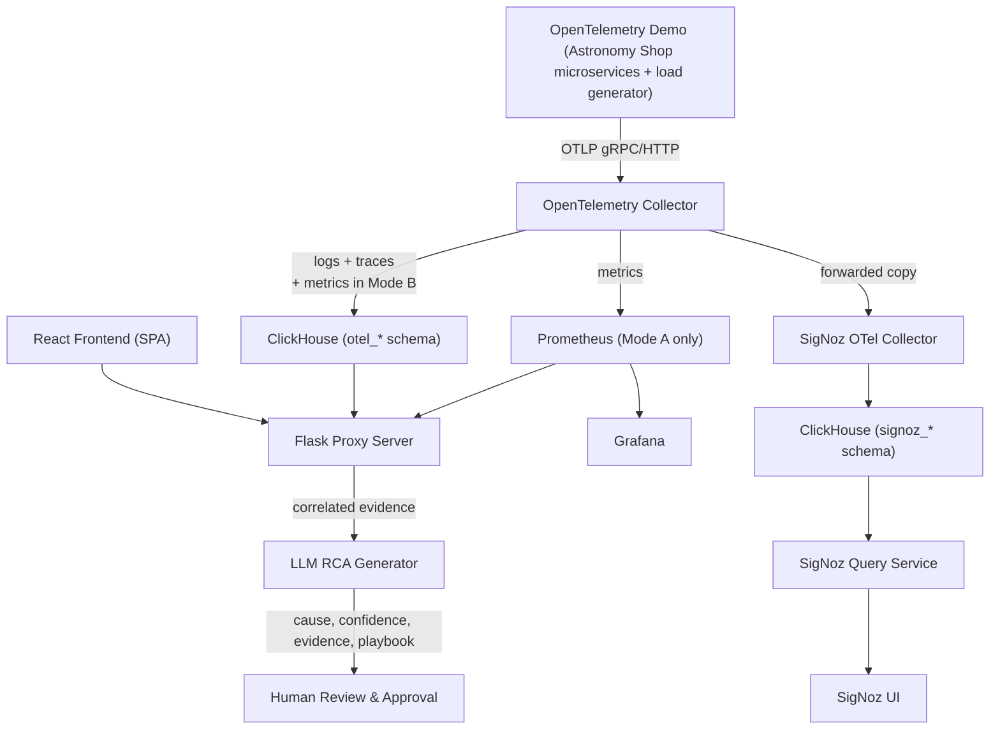

# Architecture

## System Diagram



All services sit on one Docker network (`aiops-net`) with all ports
published to the host for direct demo access — see **Network & Persistence**
below for what that trade-off means and how it's mitigated.

## Telemetry Source: OpenTelemetry Demo

The simulator is the official [OpenTelemetry Demo](https://github.com/open-telemetry/opentelemetry-demo)
("Astronomy Shop") — around 15 interdependent microservices (product
catalog, cart, checkout, payment, shipping, recommendations, ad, currency,
fraud detection, frontend, etc.) plus a Locust-based load generator that
drives continuous, realistic traffic across them. Chosen over a custom
fake-data script because:

- Telemetry is genuinely correlated across real service-to-service calls —
  not synthetic values on independent timers.
- It ships a **feature-flag service** with a UI for toggling real fault
  scenarios (e.g., product catalog errors for specific IDs, ad-service CPU
  spikes, recommendation-cache failures). This becomes the "induce an
  incident" control for demos — flip a flag, a real failure propagates
  through real services, the pipeline has something genuine to correlate
  and the LLM has something genuine to explain.

**Integration approach — single collector, not two.** The demo ships its
own OTel Collector, Jaeger, Prometheus, and Grafana by default. We do not
run any of those. Instead:

1. Vendor the demo's microservices + load generator + feature-flag service
   only (via `otel-demo/`, a pinned git submodule) — skip its
   `otel-collector`, `jaeger`, `prometheus`, and `grafana` services entirely.
2. `docker-compose.otel-demo-override.yml` overrides every demo service's
   `OTEL_EXPORTER_OTLP_ENDPOINT` to point at **our** `otel-collector`
   service, and joins them to `aiops-net`.
3. Our existing OTel Collector (Mode A/B aware, per below) becomes the
   single ingestion point for the demo's telemetry too — this keeps the
   "one entry point" design intact rather than running two collectors that
   would need reconciling.

**Resource note:** the full demo is resource-heavy (~15+ containers). For a
hackathon machine, trim to a core subset (frontend, cart, checkout,
product-catalog, payment, load-generator, feature-flag-service is usually
enough to demo a real incident) rather than running everything.

## Storage Modes

Two modes, selected at startup, not hardcoded:

| | Mode A (default) | Mode B |
|---|---|---|
| Metrics | Prometheus (PromQL) | ClickHouse (`otel_metrics_*` tables) |
| Logs/Traces | ClickHouse | ClickHouse |
| When to use | Demo, full PromQL/Grafana metrics support | Lower footprint, single database |

**Mechanism — Docker Compose profiles, not dynamic file generation.**
Prometheus is tagged with `profiles: ["mode-a"]` in `docker-compose.yml`.
Running `docker compose --profile mode-a up` includes it; running
`docker compose up` without the flag omits it entirely (Mode B). This
replaces the "proxy dynamically rewrites docker-compose.yml" idea from
earlier drafts — Compose's own profile mechanism does this natively and
correctly, no runtime YAML generation needed.

The OTel Collector config is mode-specific too: two static files,
`config/otel-collector-config-mode-a.yaml` (metrics → Prometheus exporter,
logs/traces → ClickHouse exporter) and `config/otel-collector-config-mode-b.yaml`
(everything → ClickHouse exporter, including the `otel_metrics_*` tables).
The correct file is selected via the `STORAGE_MODE` env var and mounted by
`docker-compose.yml`.

**Consequence for the proxy server:** the correlation engine cannot assume
Prometheus exists. It queries through a `MetricsQueryAdapter` interface with
two implementations — `PrometheusAdapter` (PromQL) and
`ClickHouseMetricsAdapter` (hand-written SQL against `otel_metrics_*`) —
selected at startup based on `STORAGE_MODE`. Both return the same normalized
shape so the correlation engine and LLM payload builder never need to know
which mode is active.

## Network & Persistence

- **Network**: single bridge network `aiops-net`. Every service (OTel
  Collector, Prometheus, ClickHouse, Grafana, proxy) joins it, giving them
  DNS resolution by service name (`http://prometheus:9090`, etc.).
- **Ports**: published directly to the host (`3000` Grafana, `9090`
  Prometheus, `8123`/`9000` ClickHouse, `5000` proxy, `4317`/`4318` OTLP) —
  chosen for demo simplicity over network isolation.
- **Security note**: because Grafana's port is directly reachable, it uses
  standard username/password login (`GF_SECURITY_ADMIN_USER` /
  `GF_SECURITY_ADMIN_PASSWORD`). It does **not** use Grafana's auth-proxy
  header-trust mode — that mode blindly trusts an `X-WEBAUTH-USER` header,
  and combined with a directly exposed port, anyone could set that header
  themselves and log in as any user. Auth-proxy mode only becomes safe to
  revisit if Grafana's port is later removed from the published list and
  only the proxy can reach it internally.
- **Persistent volumes** (named, not bind mounts): `prometheus_data`,
  `clickhouse_data`, `grafana_data`. All three survive `docker compose down`
  (but not `down -v`), so demo data isn't lost between restarts.

## GUI & Frontend

A separate React SPA (`frontend/`) calls the Flask proxy's JSON API — it is
not server-rendered from Flask templates. Full page list, API contract, and
the first-run wizard flow are documented in **`FRONTEND.md`**, not
duplicated here. The short version: Home (health overview), Telemetry
Analysis, Tool Links (Grafana/Prometheus/SigNoz), RCA (manual trigger +
approval), and a first-run Setup wizard.

**Important constraint carried over from the health-check decision below:**
the proxy has no Docker socket access, so the GUI can *save* configuration
but cannot itself restart containers or change published ports — see
`FRONTEND.md`'s wizard section for exactly what that means in practice.

## SigNoz Integration (Dual-Collector Design)

SigNoz needs its own OTel Collector to own its ClickHouse schema
(`signoz_*` tables) — this was the reason it was deferred earlier. Now that
it's in scope, the resolution is a **fan-out at our collector**, not a
second ingestion path:

- All telemetry still enters through **our** single OTel Collector — the
  "one entry point" design is unchanged.
- Our collector's pipeline gains a second exporter branch: alongside the
  existing `otel_*` ClickHouse export, it forwards a copy via OTLP to a
  dedicated `signoz-otel-collector` container.
- `signoz-otel-collector` writes into its own `signoz_*` schema — same
  ClickHouse instance, separate database, to avoid a second ClickHouse
  container's footprint.
- `signoz-query-service` and `signoz-frontend` complete the stack, reading
  only from `signoz_*`.
- **Consequence, stated plainly:** telemetry is now stored twice — once in
  `otel_*` (for Grafana and our own correlation engine), once in `signoz_*`
  (for SigNoz's native UI). This is the accepted cost of giving SigNoz its
  real experience instead of forcing it to read foreign tables it wasn't
  built for.

## Container Health Monitoring

Per the decision to skip Docker socket access: `/api/health` on the proxy
aggregates results from hitting each service's own HTTP health endpoint —
Prometheus (`/-/healthy`), ClickHouse (`/ping`), Grafana (`/api/health`),
the OTel Collector's `health_check` extension, SigNoz's query-service health
endpoint — on a short polling interval. It does not query Docker directly.

**Accepted trade-off:** the proxy can report a service as "unreachable" but
can't distinguish "container crashed," "container never started," and
"network issue" the way real Docker state would tell it. That distinction
was traded away deliberately to avoid granting Docker-level privilege to a
service sitting behind stubbed auth on a directly exposed port.

## RCA Trigger Modes

Two modes, both configurable in the setup wizard:

- **Manual** — a person clicks "Analyze" for a chosen time window on the RCA
  page; this hits `POST /api/rca/trigger` directly.
- **Automatic** — a configurable interval (minutes), run by a backend
  scheduler (APScheduler), that triggers the same correlate → LLM flow on
  the most recent time window without a person clicking anything.

**Scope note worth being explicit about:** "Automatic" here means
*scheduled polling*, not *event-driven anomaly detection*. True anomaly
detection (a statistical or threshold-based trigger that fires only when
something looks wrong) is still the roadmap item marked disabled in
`docs/configuration-options.md` — it hasn't quietly become in-scope. Don't
conflate the two when implementing or demoing this.

## Grafana Dashboards for OpenTelemetry Demo Data

Rather than building dashboards from scratch, adapt the OpenTelemetry Demo
repository's own official Grafana dashboard definitions (it ships its own
dashboard JSON, already tuned to its services' actual metric names) via
provisioning at `config/grafana/provisioning/dashboards/`. The one required
change: update each dashboard's datasource UID reference to match our
provisioned Prometheus datasource rather than the demo's own.

## Repository / Filing Structure

```
aiops-controller/
├── AGENT.md
├── README.md
├── SKILLS.md
├── TASKS.md
├── MEMORY.md
├── ARCHITECTURE.md
├── FRONTEND.md
├── docker-compose.yml
├── docker-compose.otel-demo-override.yml
├── docker-compose.signoz.yml
├── .env.example
├── config/
│   ├── otel-collector-config-mode-a.yaml
│   ├── otel-collector-config-mode-b.yaml
│   ├── signoz-otel-collector-config.yaml
│   ├── prometheus.yml
│   └── grafana/provisioning/
│       ├── datasources/prometheus.yaml
│       └── dashboards/                # adapted from OTel Demo's own dashboards
├── otel-demo/                         # git submodule, pinned version
│   └── (vendored — see Telemetry Source section)
├── proxy/
│   ├── app.py                        # Flask app factory
│   ├── config.py
│   ├── requirements.txt
│   ├── adapters/
│   │   ├── metrics_adapter.py        # base interface
│   │   ├── prometheus_adapter.py
│   │   └── clickhouse_metrics_adapter.py
│   ├── correlation/engine.py
│   ├── rca/llm_client.py
│   ├── scheduler/rca_scheduler.py    # automatic RCA trigger (interval-based)
│   ├── routes/
│   │   ├── health.py
│   │   ├── correlate.py
│   │   ├── rca.py
│   │   ├── config.py                 # setup wizard save/read endpoints
│   │   └── tools.py                  # tool-link list for the GUI
│   └── tests/
├── frontend/                          # React SPA — see FRONTEND.md
│   ├── src/
│   │   ├── pages/
│   │   │   ├── Setup.jsx
│   │   │   ├── Home.jsx
│   │   │   ├── Telemetry.jsx
│   │   │   ├── Tools.jsx
│   │   │   └── RCA.jsx
│   │   ├── api/client.js
│   │   └── App.jsx
│   └── package.json
└── docs/
    ├── configuration-options.md
    └── diagrams/
```

## Component Descriptions

**React Frontend (SPA)** — calls the Flask proxy's JSON API exclusively; no
server-rendered pages. Hosts the first-run Setup wizard, Home/health view,
Telemetry Analysis view, Tool Links page, and RCA page. Full detail in
`FRONTEND.md`.

**OpenTelemetry Collector** — single ingestion point, routes by signal type
per the active mode's config file.

**Prometheus** (Mode A only) — metrics storage, PromQL. Grafana reads it
directly; the proxy also reads it via `PrometheusAdapter`.

**ClickHouse** — logs + traces always; metrics too in Mode B. Auto-creates
`otel_logs`/`otel_traces` (and `otel_metrics_*` in Mode B) via the
Collector's exporter, `trace_id` included — the correlation join key.

**Grafana** — dashboards, Prometheus datasource auto-provisioned via mounted
YAML. Standard login (see security note above).

**Flask Proxy Server** — orchestration reference point in docs, and home for
the correlation engine, the storage-mode adapter layer, and the LLM RCA
client. Grafana does not route through it; it talks to Prometheus directly.

**LLM RCA Generator** — receives only pre-correlated, structured evidence
(never a raw data dump), returns structured JSON: cause, confidence,
evidence, playbook.

**Human Review & Approval** — every RCA suggestion requires explicit
approval before anything is considered actioned. No auto-execution.

**SigNoz Stack** — `signoz-otel-collector`, `signoz-query-service`,
`signoz-frontend`. Receives a forwarded copy of telemetry from our main
collector; owns its own `signoz_*` ClickHouse schema. See SigNoz
Integration above.

## Current Scope Boundaries

- Auth: single hardcoded user behind a swappable interface, not real login.
- Visualization: Grafana and SigNoz both active, each independently
  toggleable in setup config; Prometheus's own GUI is a separate toggle
  from Prometheus-as-storage (Mode A).
- Container health: HTTP-only checks, no Docker socket — see Container
  Health Monitoring above for what that trades away.
- RCA automatic mode: scheduled polling, not anomaly-detection-triggered.
- Access control, multi-tenancy, notifications, real anomaly detection:
  still out of scope, tracked as roadmap items, not built.
